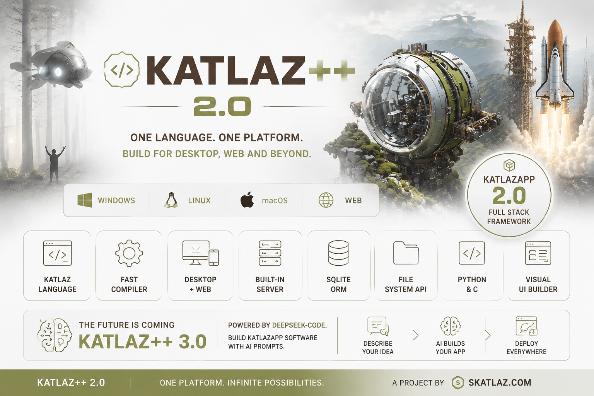

# 🚀 Katlaz Framework

> ⚡ Experimental framework for building **web + desktop applications**
> 🧠 Custom language (`.katlaz`)
> 🔗 Simple JavaScript ↔ Python bridge
> 🖥️ Native runtime (GTK + WebKit)

---

# 📌 Overview

Katlaz is an all-in-one system that combines:

* 🧠 A custom scripting language (`.katlaz`)
* ⚙️ A compiler (Katlaz → Python)
* 🔗 A bridge between UI (HTML/JS) and backend (Python)
* 🖥️ A lightweight desktop runtime
* 🧩 A system abstraction layer (`.pcl`)

---

# 📦 Project Structure

```bash
katlaz/
│
├── katlaz.pyx
│
├── runtime/
│   ├── core.py
│   ├── bridge.py
│   ├── loader.py
│
├── compiler/
│   ├── parser.py
│   ├── transpiler.py
│
├── pcl/
│   ├── windows.pcl
│   ├── linux.pcl
│   ├── mac.pcl
│   ├── android.pcl
│   ├── ios.pcl
│
├── app/
│   ├── app.html
│   ├── katlaz.js
│   ├── AppMain.cpp
│
└── Makefile / build scripts
```

---

# VIEW KATLAZ BY COMPILER:


# VIEW KATLAZAPP THE APP BUILDER BY KATLAZ:


---

# ⚡ Installation

### Requirements

* Python 3.10+
* GCC / G++
* GTK3 + WebKit2GTK (Linux/macOS)
* MSYS2 (Windows)

---

# 🚀 Usage

## Create a project

```bash
katlaz create my_app
cd my_app
```

---

## Create a `.katlaz` file

```katlaz
route hello:
    print "Hello from Katlaz"
```

---

## Build

```bash
katlaz build
```

---

## Run

```bash
katlaz serve
```

or desktop:

```bash
make run
```

---

# 🧠 Katlaz Language

Basic syntax:

```katlaz
route hello:
    print "Hello world"
```

### Concepts

| Keyword | Description                 |
| ------- | --------------------------- |
| `route` | Defines a callable function |
| `print` | Outputs text in backend     |

---

# 🔗 Simple Bridge (HTML ↔ Katlaz)

This is the core feature of Katlaz: connecting UI directly to backend logic.

---

## 📌 HTML → Katlaz

### HTML

```html
<button onclick="katlaz.call('hello')">
    Click me
</button>

<script>
window.katlaz = {
    call: function(name, data = {}) {
        const payload = JSON.stringify({ name, data });
        window.webkit.messageHandlers.katlaz.postMessage(payload);
    }
};
</script>
```

---

### `.katlaz`

```katlaz
route hello:
    print "Hello from Katlaz backend"
```

👉 When the button is clicked:

* HTML calls `katlaz.call("hello")`
* Backend executes `route hello`

---

## 📌 Katlaz → HTML (Response Concept)

Katlaz can send data back to the UI.

### `.katlaz`

```katlaz
route getMessage:
    print "Sending data back"
```

---

### HTML (receiving)

```html
<script>
katlaz.call("getMessage").then(response => {
    console.log("Response from backend:", response);
});
</script>
```

👉 Flow:

* Katlaz runs logic
* Returns result
* UI receives it (future async bridge)

---

# ⚙️ Runtime

Handles execution of compiled `.katlaz` code.

### Example

```python
runtime.register("hello", func)
```

---

# ⚙️ Compiler

### Parser

Converts `.katlaz` → AST

### Transpiler

Converts AST → Python

---

# 🧩 System Layer (.pcl)

Defines platform-specific features.

### Example

```pcl
system mouse.position:
    exec "xdotool getmouselocation"
```

---

# 🖥️ Desktop Runtime

Built with:

* GTK
* WebKit2GTK
* C++

Runs your HTML as a native app.

---

# 🔥 CLI Commands

```bash
katlaz create <name>
katlaz build
katlaz serve
```

---

# 🧱 Architecture

```
.katlaz → parser → AST → transpiler → Python → runtime → UI
```

---

# 🚀 Roadmap

* [ ] Advanced syntax
* [ ] Reactive state system
* [ ] Async bridge (Promises)
* [ ] UI components
* [ ] Mobile support
* [ ] Native system APIs

---

# 💡 Vision

Katlaz aims to be:

> ⚡ A lightweight alternative to Electron
> 🧠 A unified frontend + backend system
> 🔗 Simple and powerful

---

# 🤝 Contributing

1. Fork the repo
2. Create a branch
3. Commit changes
4. Open a Pull Request

---

# 📜 License

MIT

---

# 🚧 Status

Experimental project under development.

---

# 💥 Final Note

Katlaz is not just a framework.

It is:

* a language
* a runtime
* a compiler
* a platform

---

👉 Build apps
👉 Control the system
👉 Own the full stack

